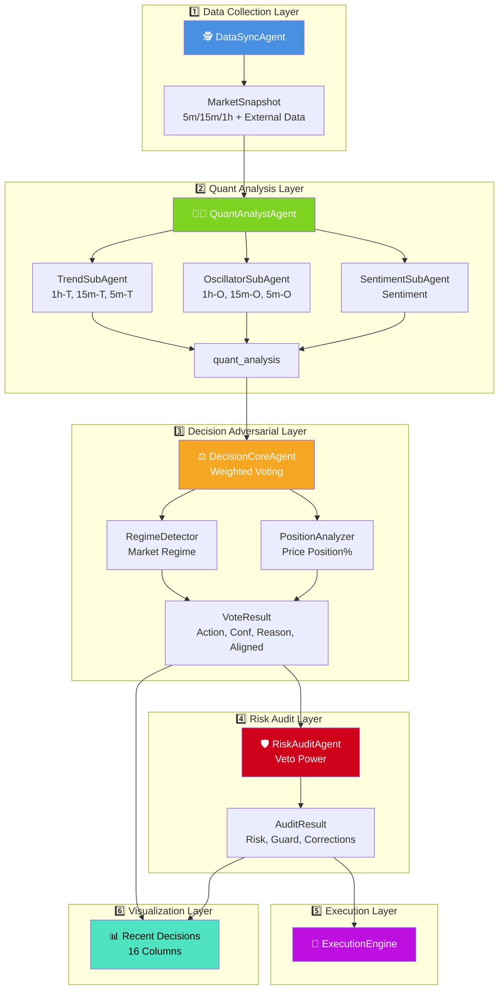

# 🤖 LLM-TradeBot

[](README.md) [](README_CN.md)


Intelligent Multi-Agent Quantitative Trading Bot based on the **Adversarial Decision Framework (ADF)**. Achieves high win rates and low drawdown in automated futures trading through market regime detection, price position awareness, dynamic score calibration, and multi-layer physical auditing.

[](https://www.python.org/)
[](LICENSE)
[](https://github.com/EthanAlgoX/LLM-TradeBot)

---

## ✨ Key Features

- 🕵️ **Perception First**: Unlike strict indicator-based systems, this framework prioritizes judging "IF we should trade" before deciding "HOW to trade".
- 🤖 **Multi-Agent Collaboration**: 4 highly specialized Agents operating independently to form an adversarial verification chain.
- ⚡ **Async Concurrency**: Currently fetches multi-timeframe data (5m/15m/1h) concurrently, ensuring data alignment at the snapshot moment.
- 🛡️ **Safety First**: Stop-loss direction correction, capital pre-rehearsal, and veto mechanisms to safeguard live trading.
- 📊 **Full-Link Auditing**: Every decision's adversarial process and confidence penalty details are recorded, achieving true "White-Box" decision-making.

---

## 🚀 Quick Start

### Startup Flow


### Detailed Steps

#### 1. Install Dependencies

```bash
pip install -r requirements.txt
```

#### 2. Configure Environment

```bash
# Copy environment variable template
cp .env.example .env

# Set API Keys
./set_api_keys.sh
```

#### 3. Configure Trading Parameters

```bash
# Copy config template
cp config.example.yaml config.yaml
```

Edit `config.yaml` to set parameters:

- Trading pair (symbol)
- Max position size (max_position_size)
- Leverage (leverage)
- Stop loss/Take profit % (stop_loss_pct, take_profit_pct)

#### 4. Start Web Dashboard (Recommended)


Built-in modern real-time monitoring dashboard.

```bash
# Start main program (automatically starts Web server)
python main.py --mode continuous
```

After startup, visit: **<http://localhost:8000>**

**Dashboard Features**:

- **📉 Real-time K-Line**: Integrated TradingView widget, 1-minute real-time updates
- **📈 Net Value Curve**: Real-time equity tracking
- **📋 Decision Audit**: Full history of decision records, including detailed Agent scores (Strategist, Trend, Oscillator, Sentiment)
- **📜 Trade History**: Complete record of all trades and PnL statistics
- **📡 Live Log Output**: Real-time scrolling logs with highlighted Agent tags (Oracle, Strategist, Critic, Guardian), 500-line history buffer

---

## 📁 Project Structure

### Directory Tree


### Directory Description

```text
LLM-TradeBot/
├── src/                    # Core Source Code
│   ├── agents/            # Multi-Agent Definitions (DataSync, Quant, Decision, Risk)
│   ├── api/               # Binance API Client
│   ├── data/              # Data Processing (processor, validator)
│   ├── execution/         # Order Execution Engine
│   ├── features/          # Feature Engineering
│   ├── monitoring/        # Monitoring & Logging
│   ├── risk/              # Risk Management
│   ├── strategy/          # LLM Decision Engine
│   └── utils/             # Utilities (DataSaver, TradeLogger, etc.)
│
├── docs/                  # Documentation
│   ├── data_flow_analysis.md          # Data Flow Analysis
│   └── *.png                          # Architecture & Flow Diagrams
│
├── data/                  # Structured Data Storage (Archived by Date)
│   ├── market_data/       # Raw K-Line Data
│   ├── indicators/        # Technical Indicators
│   ├── features/          # Feature Snapshots
│   ├── decisions/         # Final Decision Results
│   └── execution/         # Execution Records
│
├── logs/                  # System Runtime Logs
├── tests/                 # Unit Tests
├── config/                # Configuration Files
│
├── main.py                # Main Entry Point (Multi-Agent Loop)
├── config.yaml            # Trading Parameters
├── .env                   # API Key Configuration
└── requirements.txt       # Python Dependencies
```

---

## 🎯 Core Architecture

### Adversarial Multi-Agent Workflow

1. **🕵️ DataSyncAgent**: Asynchronously fetches multi-timeframe (5m, 15m, 1h) K-lines & external quant data (Netflow, Long/Short Ratio) to ensure snapshot consistency.
2. **👨‍🔬 QuantAnalystAgent**: Responsible for multi-dimensional signal extraction. Integrates 3 Sub-Agents (Trend, Oscillator, Sentiment) to output comprehensive scores combining native indicators & external data.
3. **⚖️ DecisionCoreAgent**: **The Core Adversarial Layer**. Integrates position awareness, regime detection, and a 6-source weighted voting mechanism to "cleanse" quantitative signals based on market environment, outputting high-quality decisions.
4. **🛡️ RiskAuditAgent**: **The Final Guard**. Performs physical isolation auditing on DecisionCore outputs, ensuring risk exposure and R/R meet adversarial requirements.
5. **🚀 ExecutionEngine**: Handles the final 100ms execution of trading signals and full lifecycle order tracking.

### Collaboration Sequence


### Data Flow Architecture


**Architecture Details**:

1. **Data Collection Layer** (Blue): DataSyncAgent async concurrent collection
2. **Quant Analysis Layer** (Green): QuantAnalystAgent with 3 parallel Sub-Agents
3. **Decision Adversarial Layer** (Orange): DecisionCoreAgent with regime-aware weighted voting
4. **Risk Audit Layer** (Red): RiskAuditAgent final check and auto-correction
5. **Execution Layer** (Purple): ExecutionEngine order execution
6. **Visualization Layer**: Recent Decisions table showing full Agent data (16 columns)

#### Detailed Flowchart



> 📖 **Detailed Docs**: See [Data Flow Analysis](./docs/data_flow_analysis.md) for complete mechanisms.

---

## 📄 Full-Link Data Auditing

### Data Storage Structure


### Storage Organization

The system automatically records intermediate processes for each cycle in the `data/` directory, organized by date for easy review and debugging:

```text
data/
├── market_data/           # Raw Multi-Timeframe K-Lines
│   └── {date}/
│       ├── BTCUSDT_5m_{timestamp}.json
│       ├── BTCUSDT_5m_{timestamp}.csv
│       ├── BTCUSDT_5m_{timestamp}.parquet
│       ├── BTCUSDT_15m_{timestamp}.json
│       └── BTCUSDT_1h_{timestamp}.json
│
├── indicators/            # Full Technical Indicators DataFrames
│   └── {date}/
│       ├── BTCUSDT_5m_{snapshot_id}.parquet
│       ├── BTCUSDT_15m_{snapshot_id}.parquet
│       └── BTCUSDT_1h_{snapshot_id}.parquet
│
├── features/              # Feature Snapshots
│   └── {date}/
│       ├── BTCUSDT_5m_{snapshot_id}_v1.parquet
│       ├── BTCUSDT_15m_{snapshot_id}_v1.parquet
│       └── BTCUSDT_1h_{snapshot_id}_v1.parquet
│
├── context/               # Quant Analysis Summary
│   └── {date}/
│       └── BTCUSDT_quant_analysis_{snapshot_id}.json
│
├── llm_logs/              # LLM Input Context & Voting Process
│   └── {date}/
│       └── BTCUSDT_{snapshot_id}.md
│
├── decisions/             # Final Weighted Vote Results
│   └── {date}/
│       └── BTCUSDT_{snapshot_id}.json
│
└── execution/             # Execution Tracking
    └── {date}/
        └── BTCUSDT_{timestamp}.json
```

### Data Formats

- **JSON**: Human-readable, used for configuration and decision results
- **CSV**: High compatibility, easy for Excel import
- **Parquet**: Efficient compression, used for large-scale time-series data

---

## 🛡️ Safety Warning

⚠️ **Important Safety Measures**:

1. **API Keys**: Keep them safe, DO NOT commit to version control.
2. **Test First**: Use `--test` argument to run simulations first.
3. **Risk Control**: Set reasonable stop-loss and position limits in `config.yaml`.
4. **Minimal Permissions**: Grant only necessary Futures Trading permissions to API keys.
5. **Monitoring**: Regularly check the `logs/` directory for anomalies.

---

## 📚 Documentation Navigation

| Document | Description |
|------|------|
| [README.md](./README.md) | Project Overview & Quick Start |
| [Data Flow Analysis](./docs/data_flow_analysis.md) | Complete Data Flow Mechanisms |
| [API Key Guide](./docs/API_KEYS_GUIDE.txt) | API Key Configuration Guide |
| [Config Example](./config.example.yaml) | Trading Parameters Template |
| [Env Example](./.env.example) | Environment Variables Template |

---

## 🎉 Latest Updates

**2025-12-20**:

- ✅ **Adversarial Decision Framework**: Introduced `PositionAnalyzer` and `RegimeDetector`.
- ✅ **Confidence Score Refactor**: Implemented dynamic confidence penalties.
- ✅ **Documentation Optimization**: Updated README to highlight adversarial architecture.
- ✅ **Project Renamed**: Officially renamed to `LLM-TradeBot`.
- ✅ **Full-Link Auditing**: Implemented complete intermediate state archiving.

---

## 🤝 Contribution

Issues and Pull Requests are welcome!

---

## 📄 License

This project is licensed under the MIT License. See the [LICENSE](LICENSE) file for details.

---

**Empowered by AI, Focused on Precision, Starting a New Era of Intelligent Quant!** 🚀
